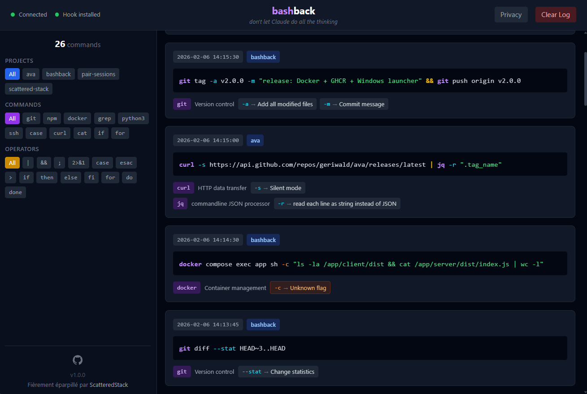
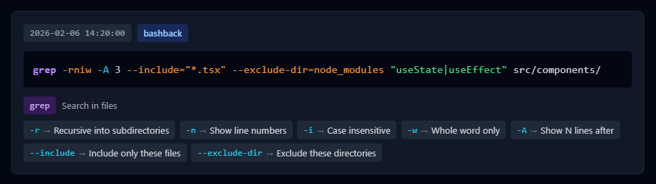
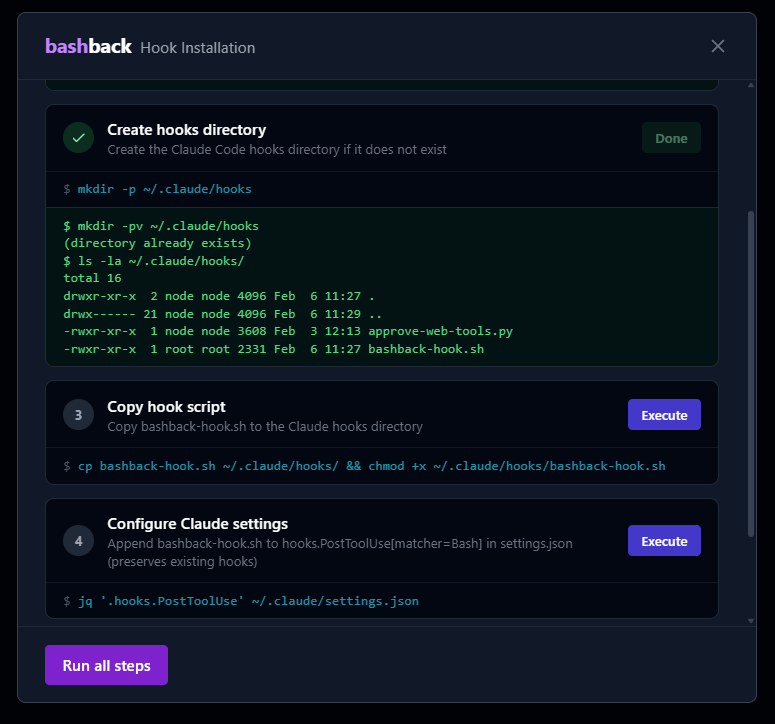
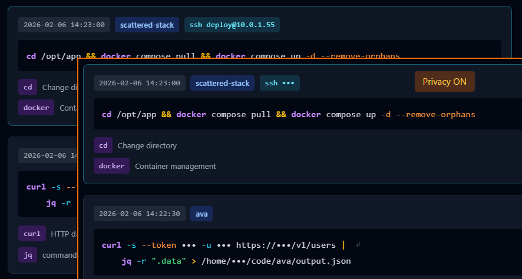

# bashback

Real-time command viewer for Claude Code sessions with pedagogical flag decomposition.



## What it does

During pair coding sessions with Claude Code, bashback intercepts every Bash command via the hook system and displays them in a clean interface with:

- Syntax-highlighted commands with operator tooltips
- Flag decomposition from `--help` parsing
- Editable descriptions you can customize and save
- Privacy mode to mask sensitive data
- SSH command transparency (shows remote commands)
- Real-time WebSocket updates



## Architecture

```
Claude Code → bashback-hook.sh → /tmp/bashback.log → Node.js server → WebSocket → React UI
```

```
┌─────────────────┐      hook stdin       ┌─────────────────┐
│  Claude Code    │ ───────────────────▶  │  bashback-hook  │
│  (terminal)     │                       │  (bash script)  │
└─────────────────┘                       └────────┬────────┘
                                                   │ append
                                                   ▼
                                          /tmp/bashback.log
                                                   │
                                                   │ fs.watch
                                                   ▼
┌─────────────────┐      WebSocket        ┌─────────────────┐
│  bashback UI    │ ◀────────────────────│  bashback server│
│  (React)        │                       │  (Node.js)      │
│  localhost:5173 │                       │  localhost:3001 │
└─────────────────┘                       └─────────────────┘
```

## Quick Start

### Option 1: Docker (recommended)

```bash
docker run -d \
  --name bashback \
  -p 3001:3001 \
  -v /tmp/bashback.log:/tmp/bashback.log \
  -v ~/.claude:/root/.claude \
  --restart unless-stopped \
  ghcr.io/geriwald/bashback:latest

# Open http://localhost:3001
```

### Option 2: Development mode

```bash
# Install dependencies
npm run install:all

# Start server + client
npm run dev

# Open http://localhost:5173
```

## Hook Installation

Click the **Install hook** button in the bashback UI to open the step-by-step installer.



The installer will:
1. Check that `jq` is installed
2. Create the `~/.claude/hooks/` directory
3. Copy the hook script
4. Configure Claude Code settings
5. Verify the installation

After installation, **restart Claude Code** to activate the hook.

### Manual installation

See [hook/README.md](hook/README.md) for manual setup instructions.

## Platform Setup

### Linux

```bash
# One-liner: launch and open browser
./bashback.sh
```

To add a desktop shortcut:

```bash
# Edit the Exec path in bashback.desktop to match your install location
cp bashback.desktop ~/.local/share/applications/
```

### Windows (WSL2 + Docker Desktop)

1. Place `bashback.bat` somewhere accessible (e.g., Desktop)
2. Right-click → Pin to taskbar
3. Click to start bashback — it opens `http://localhost:3001` automatically

### docker-compose.yml

If you prefer using Docker Compose (requires cloning the repo or creating this file):

```yaml
services:
  bashback:
    image: ghcr.io/geriwald/bashback:latest
    ports:
      - "3001:3001"
    volumes:
      - /tmp/bashback.log:/tmp/bashback.log
      - ~/.claude:/root/.claude
    restart: unless-stopped
```

## Features

| Feature | Description |
|---------|-------------|
| Real-time commands | WebSocket updates as Claude Code runs commands |
| Flag decomposition | Parses `--help` to explain every flag |
| Custom descriptions | Edit and save your own explanations |
| Privacy mode | Mask IPs, paths, and sensitive data |
| SSH transparency | Shows remote commands inside SSH sessions |
| Operator tooltips | Explains `&&`, `\|\|`, `\|`, `>`, `>>`, etc. |
| Heredoc handling | Collapses heredoc content for readability |
| Inline code detection | Simplifies `node -e '...'` displays |
| Workspace detection | Identifies projects by git root; non-git directories shown in *italics* |

### Privacy mode

Mask IPs, credentials, tokens, home paths, and hostnames with a single click.



> **Note:** bashback identifies project names from the git root directory. If Claude Code runs commands outside a git repository, the workspace name falls back to the current directory name and appears in *italics* in the UI.

## Stack

- **Frontend**: React 18 + TypeScript + Vite + Tailwind CSS
- **Backend**: Node.js + Express + WebSocket
- **Hook**: Bash script + jq
- **Deployment**: Docker (multi-stage build)
- **CI/CD**: GitHub Actions → GHCR

## Contributing

```bash
# Clone and install
git clone https://github.com/geriwald/bashback.git
cd bashback
npm run install:all

# Development
npm run dev
```

## License

MIT
